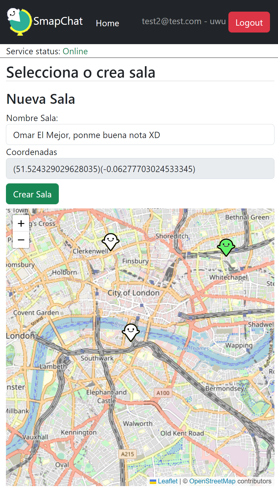

# SMAPCHAT
Repositorio que contiene FRONT-END y BACK-END del proyecto final del **Bootcamp de Node.js** de la **IT-Academy**.

**Smapchat es un chat en el que tu puedes crear las salas utilizando un mapa.**

**¡Ojo no marques nunca tu dirección exacta!** <small>(disclaimer necesario para no tener problemas legales, según mi abogado)</small>



## Creditos
- La programación del proyecto ha sido por parte de **Luis Quevedo**, propietario de este repo. ([Linkedin](https://www.linkedin.com/in/luisquevedoferreiros/))

- El maravilloso logo y los pines son idea y obra de la artista **Marie Gonzalez** ([web](http://misscapricho.com/), [Linkedin](https://www.linkedin.com/in/marieklaragonzalez/), [Instagram](https://www.instagram.com/marieklaragonzalez/)), le pago con visibilidad 🤣


Tecnologías utilizadas:
- Backend: Node.js, Express, Socket.io, MongoDB, JWT...
- Frontend: React, Leaflet/React-leaflet, Socket.io-client...

## Estructura
En este repo encontrarás 3 carpetas:
- backend: Código fuente del backend.
- frontend: Código fuente del frontend.
- ASSETS_ORIGINALES: Aquí encontrarás las imagenes originales utilizadas en el proyecto. Me gusta guardarlo todo...

## Déjate de rollos que quiero ponerlo en marcha
### Instala dependencias
para que funcione el proyecto debes tener instalados node.js y MongoDB.
Para instalar las dependencias deberás ejecutar en las carpetas frontend y backend respectivamente.
```
npm install
```

### Ejecuta back y front
Para poner en marcha el back y el front también deberás ejecutar el siguiente comando en las carpetas backend y frontend respectivamente:
```
npm start
```

# ¡Muchas gracias por usar Smapchat! Algún día podrás decir que fuiste de los primeros que lo utilizó.
